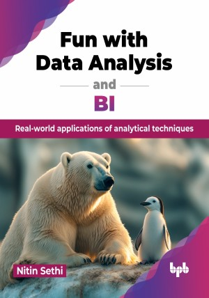

# Fun with Data Analysis and BI

Real-world applications of analytical techniques.

This is the repository for [Fun with Data Analysis and BI
](https://bpbonline.com/products/fun-with-data-analysis-and-bi?variant=44064957300936),published by BPB Publications.

## About the Book
Fun with Data Analysis and BI teaches you how to turn raw data into actionable insights using business intelligence tools. It equips you with essential skills to make data-driven decisions and effectively communicate findings.

This book is designed to guide you through learning SQL from the ground up. Starting with installation and environment setup, it covers everything from building databases and creating tables to mastering SQL queries. Alongside theoretical concepts, you will engage in hands-on projects that demonstrate practical applications, including market analysis using Python to track stock trends and churn analysis to understand customer behavior. Each chapter concludes with MCQs to test your knowledge. The book also introduces you to Tableau, a powerful tool for creating visualizations without writing code, with step-by-step instructions on how to use it for your data projects.

By the end of this book, you will be equipped with the skills to extract valuable insights from complex datasets, visualize data in compelling ways, and make data-driven decisions that positively impact your organization. 

## What You Will Learn
• Install and set up SQL environments, create databases, develop tables, and write effective SQL queries.

• Use Python to analyze stock market data, create clusters, and support data-driven decisions.

• Apply ML to understand consumer behavior, predict churn, and improve retention.

• Design striking data visuals with Tableau, enhancing data presentation skills without coding.

• Gain hands-on experience by working on complete projects, from data preparation to final output.
